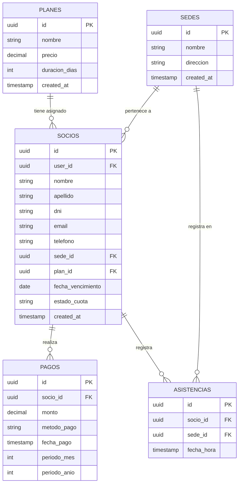

# Esquema de Base de Datos — Sistema de Gestión para Gimnasios

**Materia:** Trabajo Final Integrador (UTN)  
**Grupo:** 102  
**Fecha de actualización:** Septiembre 2026  

---

## Enfoque Arquitectónico

Siguiendo las recomendaciones recibidas para optimizar los tiempos de desarrollo, el modelo de datos se diseñó bajo un esquema simplificado y eficiente mediante **Supabase (PostgreSQL)**. 

El modelo evita la sobreingeniería y las tablas intermedias innecesarias, permitiendo:
- Consultas de estado de cuota en tiempo real mediante API REST/BaaS.
- Soporte nativo para arquitectura multisede.
- Desacoplamiento entre la ficha del socio y la autenticación de usuarios.

---

## 📊 Diagrama Entidad-Relación (DER)

    ## 🔗 Explicación de Relaciones entre Entidades

1. **`sedes` 1 ─── N `socios` (Una sede tiene muchos socios)**
   - **Clave foránea:** `socios.sede_id` ➔ `sedes.id`
   - **Descripción:** Cada socio está registrado en una sede principal de la cadena. Esto permite filtrar listados, reportes de facturación y cupos por establecimiento.

2. **`planes` 1 ─── N `socios` (Un plan es contratado por muchos socios)**
   - **Clave foránea:** `socios.plan_id` ➔ `planes.id`
   - **Descripción:** Determina qué membresía tiene activa el socio (ej. *Pase Libre*, *3 veces por semana*) y sirve de base para calcular el monto y los días de vigencia de las renovaciones.

3. **`socios` 1 ─── N `pagos` (Un socio realiza muchos pagos)**
   - **Clave foránea:** `pagos.socio_id` ➔ `socios.id`
   - **Descripción:** Guarda el historial transaccional de cuotas cobradas a cada cliente. Cada vez que se registra un pago, se actualizan la `fecha_vencimiento` y el `estado_cuota` en la ficha del socio.

4. **`socios` 1 ─── N `asistencias` (Un socio registra muchos ingresos)**
   - **Clave foránea:** `asistencias.socio_id` ➔ `socios.id`
   - **Descripción:** Almacena cada evento de acceso en el molinete/refección. Permite validar si el socio está al día antes de dejarlo ingresar y consultar métricas de concurrencia.

5. **`sedes` 1 ─── N `asistencias` (Una sede recibe muchas asistencias)**
   - **Clave foránea:** `asistencias.sede_id` ➔ `sedes.id`
   - **Descripción:** Registra en qué sede física específica ocurrió la asistencia, independientemente de la sede de origen del socio (soporte para socios en tránsito multisede).

---

## ⚙️ Reglas de Negocio Integradas en el Esquema

* **Validación de Ingreso en Puerta:** Para dar paso en recepción no hace falta calcular dinámicamente todo el historial de pagos. La API consulta directamente las columnas `estado_cuota` y `fecha_vencimiento` de la tabla `socios`.
* **Identificación de Morosos:** Si `fecha_vencimiento` < fecha actual, el sistema pasa el `estado_cuota` a `'vencido'`, denegando el acceso y habilitando el envío de avisos automáticos de cobro.
* **Acceso Móvil Opcional:** La columna `user_id` de la tabla `socios` es opcional (acepta valores `NULL`). Esto permite que un recepcionista dé de alta a un socio de forma inmediata sin obligarlo a crear una cuenta o correo en el momento.
